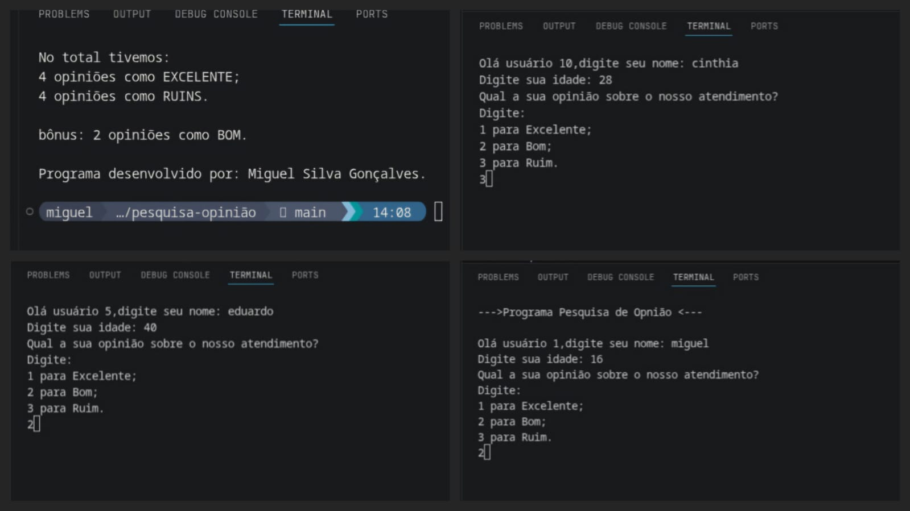

# Pesquisa de Opinião

Este projeto é uma aplicação desenvolvida para a coleta e análise de pesquisas de opinião, permitindo registrar e visualizar o feedback dos usuários de forma simples e eficiente.

> **Observação sobre a amostragem:** A proposta inicial da pesquisa previa a coleta de dados de 50 pessoas. No entanto, para fins de teste e verificação do correto funcionamento da aplicação, foram cadastrados e processados dados de 10 participantes nesta versão de demonstração.

## 🚀 Funcionalidades

* Coleta de dados e opiniões dos usuários
* Processamento e exibição dos resultados
* Interface intuitiva para interagir com a pesquisa

## 📷 Demonstração

Abaixo está o registro visual do funcionamento da aplicação:

## 🛠️ Tecnologias Utilizadas

* Python, VSCode e git.
